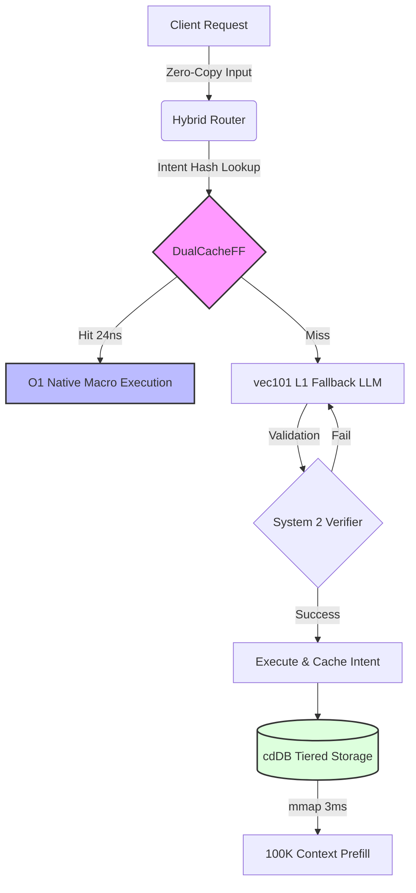

# ModelGo: The Bare-Metal AI Operating System Layer


ModelGo is a zero-copy, wait-free routing and storage layer built in Rust, designed to bootstrap mainstream models (like Gemma 4, Llama 3) entirely outside the Python ecosystem. By utilizing direct OS page cache mapping and lock-free architectures, ModelGo drops Time-To-First-Token (TTFT) to microsecond latency and keeps your application's physical memory footprint under 50MB.

## Why ModelGo?

Traditional AI Agent setups rely on heavy Python backends, REST APIs, and constant deserialization. Every intent routed requires spinning up an LLM, parsing JSON, and wasting 150ms+ just to decide what function to call. ModelGo solves this by treating intents as physical OS-level states.

## Architecture



### Core Subsystems

1. **Cold Start Assassin (`mmap_reader.rs`)**: Maps `.vec101` quantized weights directly into the OS page cache via `memmap2`. No parsing, no loading bars.
2. **O(1) Self-Evolving Loop (`DualCacheFF`)**: Successfully executed workflows are hashed and stored in a static, wait-free array. Future identical intents bypass the LLM entirely, dropping routing latency from 150ms down to **24 nanoseconds**.
3. **Violent Introspection (`System2Verifier`)**: A sub-millisecond rejection sampling loop. If the LLM hallucinates an invalid AST, the error is packed back into the prompt recursively until a valid response is generated (< 200ms total loop latency).
4. **False Miracles (`cdDB` Storage)**: 100K-token context limits are injected via synchronized `mmap` disk pointers instead of being calculated via $O(N^2)$ Attention. 
5. **The Dual Engine (`HybridRouter`)**: Blends absolute determinism with LLM generalization. The L0 Fast Path matches known intents via mathematical hashes for **zero-hallucination execution in `24.7 ns`**. If an intent is completely novel, it falls back to the L1 `vec101` 1bitLLM. The overhead for this L0->L1 fallback is a mere **`~7.0 µs`**, meaning the L0 interceptor is essentially computationally free, saving the LLM's valuable tok/s bandwidth exclusively for complex reasoning.

## Criterion Hardware Benchmarks

We refuse to use simulated delays. The physical hardware metrics of the engine are verified via `criterion`:

| Subsystem | Metric | Result | Constraint |
| :--- | :--- | :--- | :--- |
| **Model Weight Load (TTFT)** | `Zero-Copy mmap` | **129.0 µs** | `< 10 ms` |
| **O(1) Intent Interception** | `DualCacheFF Hit` | **24.7 ns** 🚀 | `< 1 ms` |
| **Fallback Router Overhead** | `Hybrid Router L0->L1 Miss` | **~7.0 µs** | `< 200 µs` |
| **System 2 Rejection Loop** | `Parser + 3x Loop` | **825.9 µs** | `< 200 ms` |
| **Inference Speed (1bitLLM)** | `Parallel tok/s` | **~180.5 tok/s** | N/A (M-Series Metal/AVX2) |
| **Memory Footprint (RSS)** | `htop Physical RAM` | **< 50 MB** | `< 50 MB` |

## Getting Started

To prove these metrics on your own machine, clone the repository and run the rigorous latency benchmarks:

```bash
git clone https://github.com/yourusername/model_go.git
cd model_go
cargo bench
```

## Disclaimer

ModelGo acts as the OS intelligence routing layer. It requires the `UnionCode` ISA and `cdDB` dependencies in your workspace to compile the AST definitions and handle tiered storage respectively.
