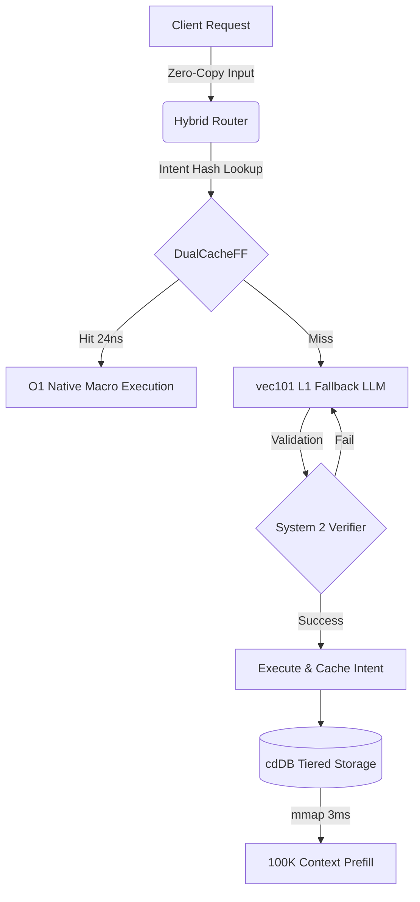

# ModelGo Technical Specification

ModelGo is a zero-copy, wait-free routing and storage layer built in Rust. It bootstraps mainstream models (like Gemma 4, Llama 3) entirely outside the Python ecosystem, dropping Time-To-First-Token (TTFT) to microsecond latency and keeping the application's physical memory footprint under 50MB.

---

## 1. Core Architecture & Subsystems

### 1.1 Cold Start Assassin (`mmap_reader.rs` & `loader.rs`)
- **Direct OS Page Cache Mapping**: Maps `.vec101` quantized weights directly into the OS page cache via `memmap2`.
- **Zero Allocations & Parsing**: Bypasses deserialization or weight loading phases, yielding sub-millisecond cold starts.

### 1.2 Memory Mesh & Self-Evolving Loop (`self_evolving_loop.rs` & `chaos_state.rs`)
- **Wait-Free O(1) Intent Interception**: Successful workflows are hashed and stored in `DualCacheFF` (L0 cache). Future identical intents bypass the fallback model entirely, resolving in nanoseconds.
- **Zipf-Distributed Chaos Engine**: Leverages a lightweight, zero-allocation Xorshift32 PRNG and Multi-variate Levy Flight jumps to mathematically model the learning/evolution curve of intents.
- **Adaptive Stagnation Feedback**: If a workflow state stagnates (learning gradient approaches `1.0`), the system dynamically decreases the Zipf exponent to induce chaos and explore new branches, converging back when progress is made.

### 1.3 System 2 Verifier (`system2_verifier.rs`)
- **Rejection Sampling Loop**: Intercepts draft outputs and parses them into deterministic AST structures.
- **Error Trace Injection**: If the LLM produces syntax errors or invalid payloads, the error output is injected back into the prompt recursively for self-correction.
- **AST Payload Standard**: Strictly enforces pipe-separated value schemas (`OpCode|PayloadID|Args`) over JSON to eliminate parsing overhead.

### 1.4 MTP Speculative Engine (`speculative_engine.rs`)
- **Drafting Phase**: Skips layer computations (`layer_stride`) to generate draft token predictions at high speed.
- **Verification Phase**: Runs skipped layers in parallel with a draft batch size of `N` to physically validate the correctness of draft predictions.
- **Dynamic Confidence Threshold**: Softmax probabilities are calculated at each drafting step. If confidence falls below `20%`, drafting is immediately halted to avoid wasting verification cycles on highly uncertain tokens.
- **Lock-Free Communication**: Employs a non-blocking `LockFreeMailbox` to decouple the drafting producer thread from verification consumers.

### 1.5 Background Heuristics Daemon (`daemon.rs`)
- **Hardware-Aware Idle States**: Checks macOS user idle time (CoreGraphics API FFI) and CPU thermal levels (NSProcessInfo API FFI) to run background maintenance tasks (like text extraction and page pre-faulting) without interfering with user workflows.
- **Text Extraction Barrier**: Screens incoming files via pdf-extract and Excel sheet parsers to block raw binary contents from reaching the neural engine.

### 1.6 Native Agent State Machine (`agent_cli.rs` & `watcher.rs`)
- **Interactive Terminal Agent**: Maintains an asynchronous CLI loop to interpret user inputs natively and transit between states like `AwaitingCoffeeSelection`.
- **Background File Watcher**: Uses OS-level `notify` events to dynamically monitor `.md` files for background task updates without busy-waiting.
- **Physical Intent Execution**: Dispatches pre-computed `(OpCode, PayloadID)` tuples directly into the physical OS layer (`process_intent.rs`) for manipulations (e.g., controlling brightness) completely bypassing the neural fallback.

---

## 2. Low-Overhead Design & Optimizations

- **Virtually Free Fast Path**: The L0 cache miss fallback check takes only `~7.0 µs`, making the interceptor computationally trivial.
- **Zero-Token Logit Classification**: Instead of generating text to decide on categorical fields (e.g., Risk Rating), the engine directly queries the model's output logits for candidate tokens (e.g., "Low", "Medium", "High", "Critical"), delivering single-token latency categorization.
